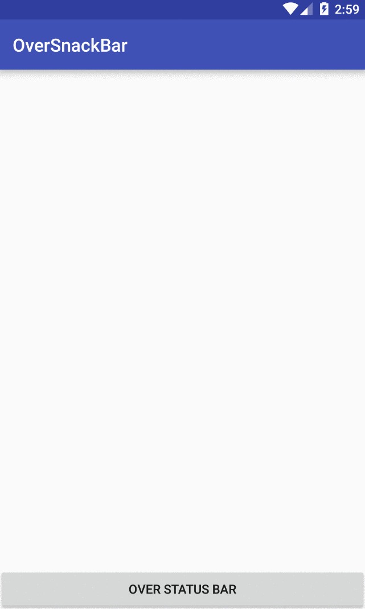

OverSnackBar
========

ABOUT
------
OverSnackBar allows to show a popup from top of the screen with some message, as normal Snackbar does. It was based on Google's Snackbar implementation.
It was created because of a need to show a progress bar from top of the screen which should have similar UI and behave as normal Snackbar.

Project is under development! Also, please keep in mind that based on [Material design guidelines](https://www.google.co.in/design/spec/components/snackbars-toasts.html#) the Snackbar should be displayed at the bottom of screen,
so use this library if you really have such requirement.

